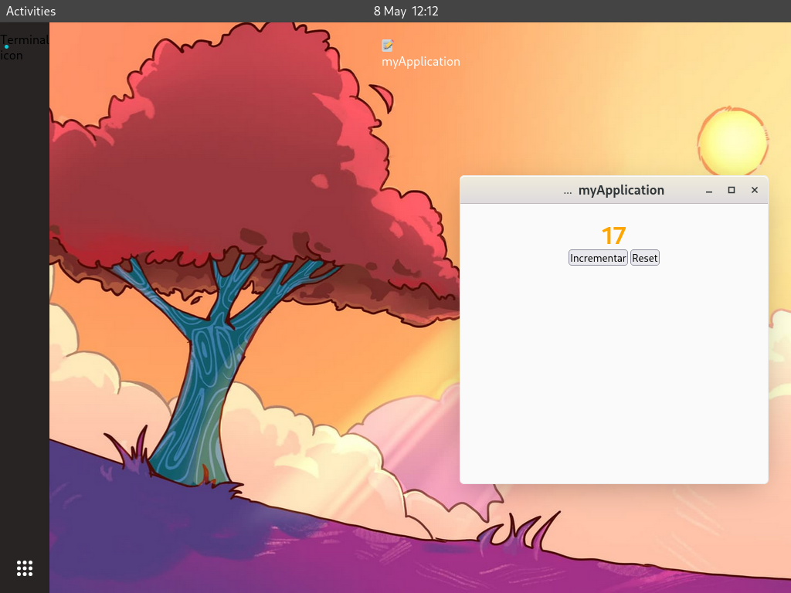

# OS.js - Un Sistema Operativo en el Navegador

**OS.js** es un proyecto que explora los fundamentos de un sistema operativo utilizando exclusivamente el stack web. Su arquitectura se divide en:

- **Frontend:** Interfaz de usuario construida con Vanilla JavaScript, HTML5 y CSS3, por el momento sin dependencias externas.
- **Backend:** Servicios de sistema, gestión de procesos y almacenamiento simulado a través de Node.js.

Este proyecto busca demostrar que conceptos como planificación de procesos, gestión de memoria y entrada/salida pueden ser emulados con herramientas modernas, sirviendo como puente entre la teoría de sistemas operativos y la práctica en la web.



## 🚀 Próximas mejoras

Estas son las funcionalidades que estamos desarrollando para las próximas versiones:

- 🧩 **Desarrollo de aplicaciones nativas**  
  Crea y ejecuta aplicaciones dentro del entorno de vanillaOS

- 🐧 **Soporte para aplicaciones Linux**  
  Compatibilidad con ejecutables y herramientas del ecosistema Linux

- 🎨 **Rediseño de la interfaz**  
  Experiencia de usuario más fluida e intuitiva

- 🪟 **Gestor de ventanas mejorado**  
  Mayor control y personalización en la organización de ventanas

## 🚀 Instalación y ejecución

### Requisitos previos
- [Node.js](https://nodejs.org/) (v16+)
- [Git](https://git-scm.com/)
- Navegador web moderno

### Pasos rápidos

```bash
# Clonar repositorio
git clone https://github.com/audioasilvab/vanillaOS.git

# Acceder a la carpeta
cd vanillaOS

# Instalación de dependencias
npm install

# Iniciar el servidor
node server
```

## 🔗 Acceso

Abre tu navegador y visita: http://localhost:8000
