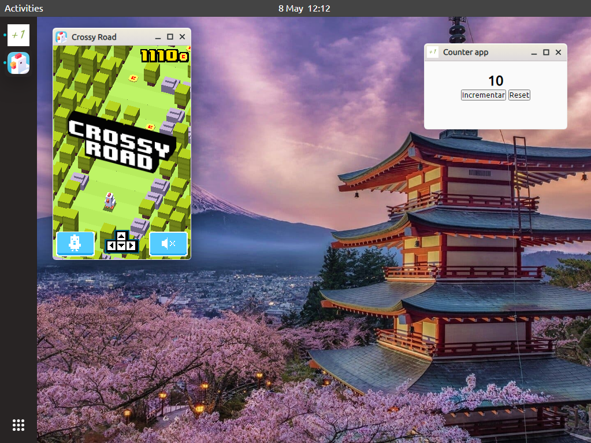

# VanillaOS.js

<!-- Estado y Tecnologías Principales -->
[](https://github.com/audioasilvab/vanillaOS/releases)
[](https://developer.mozilla.org/es/docs/Web/JavaScript)
[](https://nodejs.org/)
[](https://developer.mozilla.org/es/docs/Web/HTML)
[](https://developer.mozilla.org/es/docs/Web/CSS)

<!-- <p align="center">
  
  
  
  
</p> -->

**VanillaOS.js** es un proyecto de codigo abierto en fase de desarrollo Beta que replica las caracteristicas de un sistema operativo convencional utilizando exclusivamente el stack web. Su arquitectura se divide en:

- **Frontend:** Interfaz de usuario construida con Vanilla JavaScript, HTML5 y CSS3, sin uso de dependencias externas.
- **Backend:** Servicios de sistema, gestión de procesos a través de Node.js.



## Mejoras de la BETA 0.0.1

- 🧩 **Desarrollo de aplicaciones nativas**  
  Crea y ejecuta aplicaciones dentro del entorno de vanillaOS

- 🎨 **Rediseño de la interfaz**  
  Se mejoro el tema de la interfaz y su flujo de trabajo.

- 🪟 **Gestion de ventanas**  
  Mayor control, minimizar, maximizar y redimensionar.

- **Animaciones**
  Las ventanas y otros elementos se sientes mas naturales a momento de interactuar.

## 🚀 Instalación y ejecución

### Requisitos previos
- [Node.js](https://nodejs.org/) (v16+)
- [Git](https://git-scm.com/)
- Navegador web moderno

### Pasos rápidos

```bash
# Clonar repositorio
git clone https://github.com/audioasilvab/vanillaOS.git

# Acceder a la carpeta
cd vanillaOS

# Instalación de dependencias
npm install

# Iniciar el servidor
node server
```

## 🔗 Acceso

Abre tu navegador y visita: http://localhost:8000


## Proximas actualizaciones

Se vendran mucho mas, solo es el comienzo, en esta Beta 0.0.1 lo que se quizo lograr es refactorizar el codigo anterior de las versiones anteriores y mejorarlo para tener luego la base solida importante del flujo de la interfaz y buen manejo de las ventanas.

Algunas de novedades que quiero mencionar y lleguen muy pronto serán:

  - **Documentacion del proyecto:** resaltar su funcionamiento interno y la construcción aplicaciones para el entorno, ya que esto ultimo no esta muy claro.
  - **Personalización de la interfaz:** Cambiar los colores predeterminados de las ventanas, los fondos de pantallas y alternar entre el modo claro y oscuro.
  - **Integración de herramientas y aplicaciones basicas:** como calendario, reloj, visor de imagenes y archivos, gestor de archivos (aunque obviamente se debe de desarrollar el sistema de archivos que interactue con el de su maquina para acceder a sus archivos.).


[](https://github.com/audioasilvab)
[](mailto:audioasilvab.06@gmail.com)
